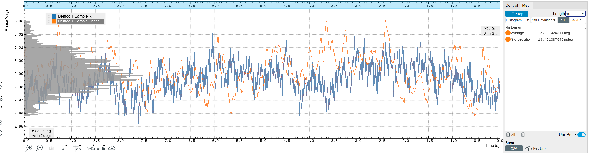

# M2p.6533 tests for continuous Erot

Tags: Characterization, Coding
Publish date: April 8, 2026 → April 10, 2026
Created by: Anzhou Wang
Projects: RFSO (radio-frequency symphony orchestra (https://www.notion.so/RFSO-radio-frequency-symphony-orchestra-2ee35e4e613f80dcb560e6834614d3fc?pvs=21)

**The test scripts are stored in spcm folder. We published a fork of the official spcm on our lab github account (jilaeedmthf).
If you need the test scripts, clone the repository.**

# Background

The previous tests were interrupted by the Verdi computer failure. The stupid computer ran into windows issue and motherboard issue. SIGH. Currently using another windows 11 borrowed from the computer shop for testing.

Copy pasted the to-do list.

Want to test:

- [x]  DDS cores allocation
- [x]  Continuous running (kind of trivial for this device)
- [x]  Digitization/quantization of frequency, amplitude, and phase
    - [ ]  Phase setting seems to be 11 bits instead of 12 bits. But this does not matter to us
- [x]  Ramp amplitude while signal is still on
    - [ ]  Demonstrated in the example code. Rather trivial
- [x]  Ramp phase by changing frequency
    - [ ]  Sick as fuck!
- [x]  Digital signal outputs in sync with the frequency

We will use this AWG in external trigger mode for local pi/2 control

# DDS phase tests

<aside>
💡

It seems that the DDS phase quantization is 360/2^11=0.1758 degree, which is 11 bits instead of 12 bits.

**When updating the DDS phase by direct setting, the reference is the execution time. The device does not keep track a T0 timing! If we want to change the phase relative to a continuous channel, the only way is to change the frequency to accumulate phase! (phase_behaviour(spcm.SPCM_DDS_PHASE_JUMP))**

</aside>

## Quantization of phase setting

Test script: spcm\src\examples\03_dds\00_dds_phase_lockin_test.py

We should be able to change phase up to 360/2^12=0.0879 degree. But the API seems to accept finer steps (suggests 16 bit).

We will use the ch0 for lock-in reference and ch1 for phase signal to test these.

Example measurement. MFLI is not at its peak performance when using external reference. Currently the 2 devices don’t share the same clock input

| Set phase (deg) | Measured phase 10 s avg (deg) | Phase Std 10s (mdeg)  |
| --- | --- | --- |
| 0 | 2.991 | 14 |
| 0.0220 | 2.993 | 13 |
| 0.0440 | 2.988 | 13 |
| 0.0879 | 2.989 | 11 |
| 0.1758 | 3.168 | 15 |
| 0.3516 | 3.338 | 17 |
| 45 | 47.992 | 12 |
| 45.022 | 47.99 | 12 |
| 45.044 | 47.993 | 14 |
|  |  |  |

Emmmm this is a bit funny. The result suggests a quantization of 0.176 degree, which is 360/2^11. So 11 bit not 12 bit.

## Quantization of frequency setting and high frequency performance

spcm\src\examples\03_dds\00_dds_frequency_quantization_low_test.py

Expect `125e6 / 2^32 = 0.0291038304567 Hz` The API return suggests the same thing.

| Set frequency (read back from the card) (Hz) | Measured frequency from Lock-in PLL (Hz) |
| --- | --- |
| 299999.956042 | 300000.07 |
| 299999.985145 | 300000.09 |
| 300000.014249 | 300000.12 |
| 300000.043353 | 300000.15 |
| 299999.548588 | 299999.65 |
| 299999.781419 | 299999.89 |
| 299999.897834 | 300000.01 |
| 300000.130665 | 300000.24 |
| 300000.24708 | 300000.35 |
|  |  |

The frequency behavior seems pretty good!

Will use a scope for the high frequency performance. spcm\src\examples\03_dds\00_dds_frequency_quantization_high_test.py (simple enough, removed)

**10 MHz**

**20 MHz**

**39 MHz**

---

**50 MHz**

**60 MHz**

The performance agrees with an output rate of 125 MHz. So at high frequency the data is quite shitty. But 10 MHz is still fine as it has 12.5 points per cycle. For 300 kHz, it has 417 points so definitely good enough.c

## Test phase with synced clock

Using the MFLI 10 MHz outputs to sync the devices. The stupid M2p.6533 requires 5Vpk 10 MHz clock signal for syncing. So I have to use another Agilent function generator to amplify the signal

Still use MFLI external reference to get the phase information. Now the fluctuation is much smaller (roughly 10 times)

| Set phase (deg) | Measured phase 10 s avg (deg) | Measured phase subtracting the offset | Phase Std 10s (mdeg)  |
| --- | --- | --- | --- |
| 0 | 2.9866 | 0.0000 | 1.5 |
| 0.0220 | 2.9866 | 0.0000 | 1.5 |
| 0.0440 | 2.9866 | 0.0000 | 1.4 |
| 0.0879 | 2.9865 | -0.0001 | 1.4 |
| 0.1758 | 3.1623 | 0.1757 | 1.5 |
| 0.3516 | 3.3382 | 0.3516 | 1.5 |
| 45 | 47.9865 | 44.9999 | 1.5 |
| 45.022 | 47.9867 | 45.0001 | 1.5 |
| 45.044 | 47.9867 | 45.0001 | 1.5 |
|  |  |  |  |

## Ramp phase of one core by changing frequency

The phase measurement ability is around 3 mdeg now. What to see if we can tune phase to that precision repeatably.

spcm\src\examples\03_dds\00_dds_phase_ramp_via_frequency_step.py

3 mdeg is a bit buggy now. **But 10 mdeg works perfectly!!!!**

**WOW! 3 mdeg works too!!! SUPER GREAT!!!**

Not ramping

Ramp down by 3 mdeg

Ramp up by 3 mdeg

Ramp down by 3 mdeg 5 times

---

Demonstration of ramping 90 degree. 100% repeatable!

## Ramp phase of 8 cores by changing frequency

Want to simulate Erot chopping on 8 channels.

Sun and I discussed about the protocol of changing phase. We both agreed that ramping all phases for a fixed amount of time make most sense.

If we want the phase sensitivity of 360/2^14, the time it takes to ramp should be 1/2^14/0.0291Hz=2.1 ms. To ramp 180 degree, we need a frequency difference of 0.5/2.1ms~240 Hz. 240 Hz is < 0.1% of 300 kHz, which means the residual magnetic field comes from the phase ramping will be safely negligible.

We can set the phase of the 8 channels to [0,45,90,135,180,225,270,315] and ramp to [0,-45,-90,-135,-180,-225,-270,-315]

Success! All channels behave!

spcm\src\examples\03_dds\00_dds_phase_ramp_multichannel.py

# DDS pulse generator tests

<aside>
💡

The pulse generator works nicely! The digital output synchronization is successful!

One annoying thing is that XIO cannot trigger the output of dds internally…

</aside>

## Basic tests

Using example codes. 3.3 V LVTTL.

## Use pulse generator for dds trigger

In my design of the control system structure, the XIO pulse generator from the M2p.6533 provides the 10 Hz digital pulse for ARTIQ and pulsed laser synchronization.

So each XIO pulse can be treated as a T0 for the phase reference too. It would be ideal to use the XIO to trigger the DDS output directly and internally.

Well it seems like there is not an option to trigger the dds internally through XIO. **Email the company about this question.**

spcm\src\examples\04_pulse-generator\00_pg_trigger_dds_external_loopback.py

Managed to use X1 output to trigger the card dds output. Can see the phase jump and drift on the scope

## Synchronize pulse generator outputs and dds frequencies

Using the Chat proposed strategy:

### 1) Grids and “no drift” condition

- DDS frequency grid: $f = k\,\frac{f_s}{2^{32}}$ with $k \in \mathbb{Z}$.
- Marker period on the event grid: $T_m = N_1 t_{re} = \frac{N_1}{f_s}$ with $N_1 \in \mathbb{Z}$.
- “No drift” condition: $fT_m \in \mathbb{Z}$.

Plugging in gives

$$
fT_m = \left(k\frac{f_s}{2^{32}}\right)\left(\frac{N_1}{f_s}\right) = \frac{kN_1}{2^{32}}.
$$

So the exact condition is

$$
\frac{kN_1}{2^{32}} \in \mathbb{Z}
\quad\Longleftrightarrow\quad
2^{32}\ \text{divides}\ kN_1.
$$

### 2) Why $m = v_2(N_1)$ matters

Write

$$
N_1 = 2^m q, \qquad q\ \text{odd}, \qquad m = v_2(N_1).
$$

Then $kN_1$ already contains a factor of $2^m$. To reach $2^{32}$, we need $k$ to contain the remaining factor $2^{32-m}$. Therefore,

$$
k \text{ must be a multiple of } 2^{32-m}.
$$

Let

$$
k = 2^{32-m} r.
$$

Then the allowed phase-locked DDS frequencies are

$$
f = k\frac{f_s}{2^{32}} = r\,\frac{f_s}{2^m}.
$$

So the RF frequency spacing is

$$
\Delta f = \frac{f_s}{2^m}.
$$

Bigger $m$ means smaller $\Delta f$, hence more choices near 300 kHz.

---

### 3) Choose $N_1$ close to 100 ms and list usable $f$ near 300 kHz

Pick $N_1$ near $12.5 \times 10^6$ but with a large power-of-two factor. A convenient choice is

$$
N_1 = 12\cdot 2^{20} = 12{,}582{,}912 = 3\cdot 2^{22},
$$

so $m = 22$.

Then the marker period is

$$
T_m = N_1 \cdot 8\,\text{ns} = 0.100663296\,\text{s},
$$

and the marker rate is

$$
f_m = \frac{1}{T_m} = \frac{125\,\text{MHz}}{12{,}582{,}912} \approx 9.93410746\,\text{Hz}.
$$

The RF grid spacing is

$$
\Delta f = \frac{125\,\text{MHz}}{2^{22}} \approx 29.8023224\,\text{Hz}.
$$

The nearest phase-locked RF frequencies to 300 kHz are:

- $r = 10066$ gives $f = 10066\,\Delta f \approx 299{,}990.177\,\text{Hz}$ (-9.823 Hz).
- $r = 10067$ gives $f \approx 300{,}019.979\,\text{Hz}$ (+19.979 Hz).

These satisfy $fT_m \in \mathbb{Z}$ exactly (no drift), and they are also exactly on the DDS tuning-word grid by construction.

Updated the spcm\src\examples\04_pulse-generator\00_pg_trigger_dds_external_loopback.py.

**Hurray! It works!**

The digital signal behaves as expected

Will leave the system on overnight and see if the phase remains good

After a day. How nice!

We should also test if restarting the code makes reproducible behavior. Previous code was buggy. The synchronization was correct but the start of the pulse is not triggered by XIO.

Multiple starts. All within scope trigger jitter.

Test with exec_now(). Things probably don’t work. Indeed the starting phase oscillates.

Emmm we should test this to higher precision as we care about 5 ns offset. We can set the digital pulse to 300 kHz and use that as the external trigger for MFLI. That should give us much higher precision

spcm\src\examples\04_pulse-generator\00_pg_trigger_dds_phase_alignment_test.py

Strategy: using kN1=2^32. N1=2^9=512. This gives us about 244 kHz

Pulse period ticks: 512
Pulse HIGH ticks: 256
Marker period: 4.096e-06 s
Marker frequency: 244140.625 Hz

| Number of tests | Phase |
| --- | --- |
| 1 | -68.7617 |
| 2 | -68.7623 |
| 3 | -68.7615 |
| 4 | -68.7616 |
| 5 | -68.7618 |

OMG the result is extremely good. 0.5 mdeg corresponds to 6 ps. Ridiculously good.

Interesting. PLL works better on digital pulse.

