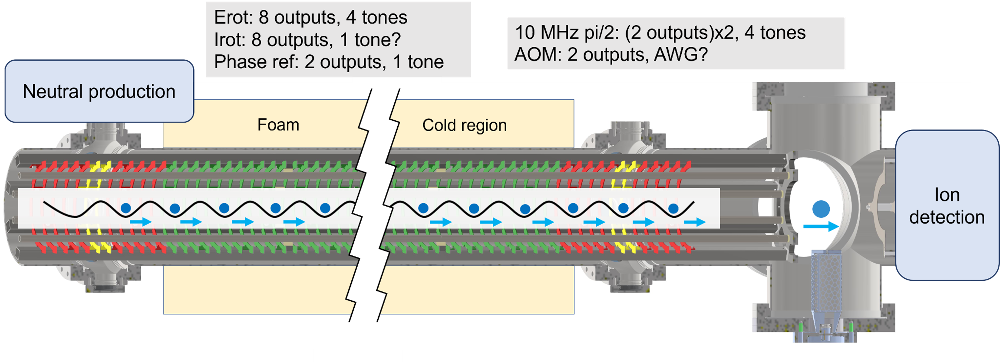

# RFSO implementation plan

Tags: Coding, Control System
Publish date: June 1, 2026 → June 2, 2026
Created by: Anzhou Wang
Projects: RFSO (radio-frequency symphony orchestra (https://www.notion.so/RFSO-radio-frequency-symphony-orchestra-2ee35e4e613f80dcb560e6834614d3fc?pvs=21)

# Background

We expect the new M2p.6533 boards to arrive tomorrow! Time to prepare an implementation plan to iron out all the design details!

After all, a good implementation plan is way more important than writing the code in vibe coding era.

# Hardware tests

Most tests are already done:

- DDS cores allocation
- Continuous running (kind of trivial for this device)
- Digitization/quantization of frequency, amplitude, and phase (the company confirms that the phase bit is actually 11 bit)
- Ramp amplitude while signal is still on
- Ramp phase by changing frequency. Sick as fuck!
- Digital signal outputs in sync with the frequency (frequency grid idea)

The new hardware tests will mostly focus on synchronization side:

- [x]  Test external clock input. The company said the normal sinewave 10 MHz clock should work. Should try again
    - June 8, 2026: `/dev/spcm1` StarHub carrier locked to a 10 MHz sine
      reference with the source set to 1 Vpp into 50 ohm and the card clock
      input 50-ohm terminated. High-impedance input did not lock. See
      [StarHub DDS synchronization hardware tests](../StarHub%20DDS%20synchronization%20tests/StarHub%20DDS%20synchronization%20tests.md).
- [x]  Test communication to each card
    - [ ]  This should be trivial. Should check if there are communication delay by using `exec_now`
- [x]  Test starhub synchronization
- [x]  Test trigger modes from multiple cards
    - [x]  Validate the two-source trigger architecture. The gated XIO trigger path and independent physical Trig In/StarHub OR path work without restarting the cards. XIO triggers phase updates; the independent Trig In path is reserved for ARTIQ amplitude ramp/jump triggers.
    - [ ]  Repeat the independent Trig In test using the actual ARTIQ TTL source.
    - [x]  Both physical Trig In ports can remain enabled and are combined by StarHub OR without restarting the cards. See [StarHub DDS synchronization hardware tests](../StarHub%20DDS%20synchronization%20tests/StarHub%20DDS%20synchronization%20tests.md).
- [ ]  Test multitone idea for lock-in amplifier
    - [ ]  I want to combine multiple frequencies we need (like frot and frf) in Lock-in ref signal. With this mode, we don’t need to update the reference unless changing frequency. Good for continuous Erot running and monitoring. But I am not sure how much this affect the lock-in performance or how much we would benefit from this trick. Maybe not much
- [ ]  Test measurement loop without ARTIQ hardware
    - [ ]  Since the AWG cards outputs will be the new timing reference ([Control system timing upgrade plan](https://www.notion.so/Control-system-timing-upgrade-plan-36435e4e613f8066a43dca125803dcf8?pvs=21) ), we should bypass the ARTIQ hardware. We probably don’t even need a trigger to lock-in since the reference signal is always in sync. Need to stare at the code for longer

# Code/controller implementation

## Experiment goal

For the analog output of the AWG cards, we need to achieve three main running modes for Erot:

- **Ultimate mode**: continuous and uninterrupted Erot and Erf. Maybe some extra RF control for quadrant rings for catching ions.
- **Mixed mode**: continuous Erot and Erf. Erot ramping in timing sequence for piby2 or kickout.
- **Original mode**: Erot and Erf ramp up at the start and ramp down in the end. Need extra ramping before/after the sequence to keep Erot on.
    - I want the `RFSO controller` (radio frequency symphony orchestra) to maintain the Erot status when one experiment sequence is done so that we don’t rely on user discipline to ramp back to correct Erot every time. Not sure if we should ramp Erot back on between shots. If the dead time becomes short, it’s probably not worth it.

Because of this continuous Erot, the experiment script needs to check the status of Erot rotation. If the Erot rotation direction (+/-) is wrong, ramp the phase to correct value first. `Erot monitoring` results may/may not be included depending on the Erot driver response consistency.

Aside from the Erot, the analog signals also need to generate:

- One reference channel for lock-in amplifier. Contain one/two tones.
- One channel for Goat/Hen AOM strobing. [Future Goat AOM signals](https://www.notion.so/Future-Goat-AOM-signals-34535e4e613f80cc8ad6cb2cd4d3d7b3?pvs=21)
    - Also requires one PRL comparators and another DDG. We can use the GenII DDG (BND model 575) for now. Its performance is not as good as dg645. If we only need Goat, we don’t need a DDG.
- Up to 4 channels for localized piby2 control. Contain four tones each.
- 8 channels for Irot, the rotating magnetic field. Will not implement in this version

For the digital input/output part, the requirements are

- Generate 9.93 Hz continuous digital signals (X0). This is demonstrated in spcm\src\examples\04_pulse-generator\00_pg_trigger_dds_external_loopback.py
- One trigger input from X1. X1 has the same outputs as X0.
- One trigger input from ARTIQ. For Erot ramping sequence trigger.
- Two standby DIO for other purposes in the future. Like the continuous digital outputs for fast I chop.

## RFSO controller (radio frequency symphony orchestra)

This is the most difficult and involved part. Let’s go through this slowly and carefully.

The current DDS controller (Erot control) design:

1. In DDS driver (controllers/DDSboards/driver.py), class `single_board` is the low-level DDS control. Other APIs in class `DDS_boards` handle the Erot generation including the O matrix.
2. The O matrix measurement and Erot circularity measurements are done through ARTIQ scripts in Vrot/vrot.py. The O matrix measurement calls `add_channel_ramp_MDAC` instead of `add_channel_ramp`
3. The current scheme controls the phase and preamp for relative phases and amplitude. The MDAC controls the ramp and use the same value for all channels.

The existing SPCM AWG controller design:

1. `SpectrumDDSController` class in controllers/awg_Spectrum_Instrumentation/driver.py initializes the card to the desired states (clock setting, external trigger, DDS modes, phase_behavior, etc.) . The settings are done through ARTIQ scripts class `spectrum_dds_control` in Misc/Misc_utils.py.
2. Provide a serialized DDS command wrapper for dds control.
    1. Can switch between the external trigger and the internal timer
    2. Can set frequency and phase
3. Provide a handshake API to check if the settings are correct and if the commands are all consumed.

For the new `RFSO controller`, we should not directly adopt either approach as we now need to control both Erot/Erf and 10 MHz RF pulses. For Erot/Erf, the target pulses are always well defined and only global amplitude is changed in timing sequence (For very rare cases we may need to ramp the ellipticity. This can be safely ignored now); For 10 MHz RF pulses, the required tones, frequencies, and phases are not settled down now. So we can benefit from some sequence flexibility here.
However, both Erot and 10 MHz RF demand well-defined phase at the new T0 (rising edge of the 9.93 Hz digital pulses). This initiates a natural implementation strategy:

**General frequency and phase control:**

1. All frequency and phase control can only be accessed through the `RFSO controller` APIs instead of the raw spcm APIs. The raw spcm APIs for frequency and phase should be blocked from the controller.
    1. The frequency and phase setting of the Erot/Erf can follow the old strategies. All corresponding cores are changed through one `set_channel_frequency/phase` API
    2. The frequency and phase setting of the 10 MHz RF can be a list containing `[core_ind, freq, phase]`
2. Whenever setting frequency, the corresponding phase needs to be set simultaneously since the internal tuning word register runs continuously. Only setting frequency does not yield a well defined phase.
3. The trigger for phase setting has to be 9.93 Hz signal (X1 output). This is the only way that guarantees well-defined phase for all available frequencies without drift.
    1. Technically speaking, the 10 MHz RF signal does not demand well-defined at every rising edge of the 9.93 Hz signal. But we don’t need extra flexibility here
4. For Erot circularity feedback/fine phase tuning,  we can use the frequency jump method. This can be implemented later.

**General amplitude control:**

1. For Erot/Erf, we can adopt the current `DDS_boards` strategy. We will no longer use preamp for amplitude control. So the ramping target will be an array internally instead of a single global value.
2. For 10 MHz RF, we can adopt the current `SpectrumDDSController` strategy.
3. The start of the amplitude timing sequence should be triggered by an ARTIQ TTL. Either single trigger pulse or multiple trigger pulses should work perfectly fine.

**O matrix method:**

1. We can set the Erot frequency and rod phase to 0 once at the beginning.
2. Use a similar strategy to measure the rod responses. `exec_now` would be good enough for amplitude ramping of each rod. No need to wait for any trigger.

**Continuous Erot controller:**

1. We need a separate/individual `Erot controller` running in the background to maintain the Erot status after one experiment sequence finishes. This is critical for the **mixed mode** and the **original mode** so that we don’t rely on the sequence code to ramp on/off.
2. I have not decided whether we should use an ARTIQ priority -1 task or a background thread in `RFSO controller` . Both kind of make sense and have its own advantages? Maybe a background thread that automatically keeps track of the current amplitude settings? But an ARTIQ priority -1 task can inquire the current state from the board and achieve the same effect, probably slightly slower. ARTIQ -1 task is more explicit when using.
3. A handover from `Erot controller`  to the timing sequence or vice versa is necessary. I have not decided on the details.

## Erot monitoring

The current strategy is: ARTIQ_master script → ARTIQ TTL for DDS trigger and lock-in trigger → Lock-in measure the response of DDS outputs. The current design needs the ARTIQ core device for synchronization, so it inherently cannot happen in parallel with the experiment.

The new `Erot monitoring` process can now happen in the background and in parallel with the main experiment.

In the future, the `Erot monitoring` result should be combined with the ambience monitor system (laser lock/wavelength, ambient magnetic field, amplifier temperature, room temperature). But for now we can still use something like the `warm up and feedback Erot` script.

My current design idea:

1. I want to include three status flags: `Erot_measure_ongoing` , `Erot_ready` , and `Erot_changing` . The `Erot monitoring` process only changes the first two and the sequence script only changes the last flag. The flags can be ARTIQ datasets.
2. The `Erot monitoring` process measures the Erot circularity continuously/intermittently in the background. When the lock-in measurement starts, it flips a `Erot_measure_ongoing` flag. When the circularity requirement fails, the `Erot monitoring process` should request a feedback and flips the `Erot_ready` status flag. If there is an ongoing shot, the feedback should start after the main experiment and block the main experiment until feedback is done. Not sure if we should use the ARTIQ job submission system or another flag.
3. When the experiment sequence needs to change the Erot amplitude, it should flip a `Erot_changing` flag and block the measurement process. If the lock-in measurement is ongoing (`Erot_measure_ongoing` true), the experiment should wait until the lock-in measurement is offw

This design should be sufficient for the near future. However, if we use the Erot ramping piby2 pulses for long Ramsey experiment, this design cannot monitor the Erot ciruclarity during the Ramsey evolution, which may not be a big deal for the near future.

MAK proposes that instead of using `Erot_changing` flag, we can use a TTL on/off  status to indicate the real time Erot status and post select if the `Erot monitoring` result is legit. I like this idea but this is more involved for implementation. We can leave this aside for now.
